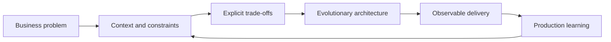

<div align="center">

<a href="https://github.com/cadmax">
  
</a>

### I turn complex business challenges into scalable, secure, and sustainable platforms.

[](https://www.linkedin.com/in/jeffersonmoraesalves)
[](https://github.com/cadmax?tab=followers)


</div>

---

## About me

I am a **Software Architect and Backend Engineer** with over a decade of experience in technology, working at the intersection of **architecture, product, and technical leadership**.

My background spans **Web3, blockchain, financial products, transactional platforms, and iGaming**, including casino and slot solutions. I am especially drawn to problems that demand deep domain knowledge, explicit architectural decisions, and systems designed for high concurrency.

```text
Context before code  •  Simplicity before abstraction
Observability from day one  •  Architecture in service of the product
```

## Impact at a glance

<table>
  <tr>
    <td align="center"><strong>10+ years</strong><br/>in technology</td>
    <td align="center"><strong>300+ clients</strong><br/>on a white-label ecosystem</td>
    <td align="center"><strong>5 years</strong><br/>building with Go</td>
    <td align="center"><strong>5 years</strong><br/>building with Java</td>
  </tr>
  <tr>
    <td align="center" colspan="2"><strong>Node.js & PHP</strong><br/>production backend systems</td>
    <td align="center" colspan="2"><strong>Async & event-driven</strong><br/>queues, SQS, Kafka, workers, and resilient processing</td>
  </tr>
</table>

## Where I create the most value

| Area | How I contribute |
|---|---|
| **Software architecture** | Distributed systems, DDD, microservices, event-driven architecture, and legacy modernization |
| **High-scale backend** | APIs, asynchronous processing, concurrency, performance, resilience, and observability |
| **White-label & SaaS** | Multi-tenancy, configuration, isolation, integrations, and operation of hundreds of brands |
| **Web3 & Blockchain** | Wallets, on-chain/off-chain integrations, automation, and digital-asset products |
| **iGaming & Betting** | Transactional platforms, slots, provider integrations, payments, and player journeys |
| **Technical leadership** | Strategy, mentoring, team design, architecture reviews, and bridging business with engineering |

## My toolbox

<div align="center">

### Backend & Core


### Data, Messaging & Web3


### Cloud, Platform & Delivery


</div>

## How I approach architecture



<details>
<summary><strong>🏗️ Principles that guide my decisions</strong></summary>

<br/>

- Start with the domain, risks, and measurable outcomes.
- Choose the simplest solution that preserves room to evolve.
- Treat security, observability, and operations as part of the product.
- Separate what needs to scale from what needs to remain easy to change.
- Record trade-offs so the team understands not only *what*, but *why*.

</details>

<details>
<summary><strong>🎰 iGaming and transactional product experience</strong></summary>

<br/>

I have worked on products connecting player journeys, game engines and slots, provider integrations, wallets, payments, promotional rules, and back-office operations. My focus is maintaining financial consistency, traceability, and low latency under heavy concurrency.

</details>

<details>
<summary><strong>⛓️ Web3 and blockchain experience</strong></summary>

<br/>

I have built products involving wallets, operational automation, and integrations between traditional services and blockchain networks, as well as backends designed for asynchronous confirmations, idempotency, and auditability.

</details>

## GitHub activity

<div align="center">


</div>

## Let's build something meaningful

I am open to conversations about **Software Architect, Staff Engineer, Tech Lead, Senior Backend Engineer, and CTO** roles—especially products facing real challenges in scale, platforms, Web3, fintech, or iGaming. I am based in Brazil and available for remote or hybrid opportunities.

<div align="center">

[](https://www.linkedin.com/in/jeffersonmoraesalves)

<sub>If my experience can help your product or team, let's talk.</sub>

</div>
