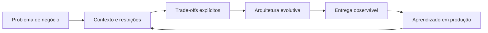

<div align="center">

<a href="https://github.com/cadmax">
  
</a>

### Transformo desafios complexos de negócio em plataformas escaláveis, seguras e sustentáveis.

[](https://www.linkedin.com/in/jeffersonmoraesalves)
[](https://github.com/cadmax?tab=followers)


</div>

---

## Sobre mim

Sou **Software Architect e Backend Engineer**, com mais de uma década de experiência em tecnologia e atuação na interseção entre **arquitetura, produto e liderança técnica**.

Como **CTO da asap.codes**, liderei a evolução de uma plataforma **white-label utilizada por mais de 300 clientes**, equilibrando velocidade de entrega, isolamento entre tenants, personalização, confiabilidade e crescimento sustentável.

Minha experiência passa por **Web3, blockchain, produtos financeiros, plataformas transacionais e iGaming**, incluindo soluções para cassinos e slots. Gosto especialmente de problemas que exigem domínio de negócio, decisões arquiteturais explícitas e sistemas preparados para alta concorrência.

```text
Contexto antes do código  •  Simplicidade antes da abstração
Observabilidade desde o início  •  Arquitetura a serviço do produto
```

## Impacto em números

<table>
  <tr>
    <td align="center"><strong>10+ anos</strong><br/>em tecnologia</td>
    <td align="center"><strong>300+ clientes</strong><br/>em ecossistema white-label</td>
    <td align="center"><strong>5 anos</strong><br/>desenvolvendo com Go</td>
    <td align="center"><strong>5 anos</strong><br/>desenvolvendo com Java</td>
  </tr>
</table>

## Onde gero mais valor

| Área | Como contribuo |
|---|---|
| **Arquitetura de software** | Sistemas distribuídos, DDD, microsserviços, arquitetura orientada a eventos e evolução de legados |
| **Backend de alta escala** | APIs, processamento assíncrono, concorrência, performance, resiliência e observabilidade |
| **White-label & SaaS** | Multi-tenancy, parametrização, isolamento, integrações e operação de centenas de marcas |
| **Web3 & Blockchain** | Wallets, integrações on-chain/off-chain, automações e produtos baseados em ativos digitais |
| **iGaming & Betting** | Plataformas transacionais, slots, integrações com provedores, pagamentos e jornadas de jogadores |
| **Liderança técnica** | Estratégia, mentoria, desenho de times, revisão arquitetural e tradução entre negócio e engenharia |

## Minha caixa de ferramentas

<div align="center">

### Backend & Core


### Data, Messaging & Web3


### Cloud, Platform & Delivery


</div>

## Como penso arquitetura



<details>
<summary><strong>🏗️ Princípios que guiam minhas decisões</strong></summary>

<br/>

- Começar pelo domínio, pelos riscos e pelos objetivos mensuráveis.
- Escolher a solução mais simples que preserve a capacidade de evolução.
- Tratar segurança, observabilidade e operação como parte do produto.
- Separar o que precisa escalar do que precisa continuar fácil de mudar.
- Registrar trade-offs para que o time entenda não apenas *o que*, mas *por quê*.

</details>

<details>
<summary><strong>🎰 Experiência em iGaming e produtos transacionais</strong></summary>

<br/>

Atuação em produtos que conectam jornadas de jogadores, engines e slots, integrações com provedores, carteiras, pagamentos, regras promocionais e backoffice. O foco é manter consistência financeira, rastreabilidade e baixa latência mesmo sob alta concorrência.

</details>

<details>
<summary><strong>⛓️ Experiência em Web3 e blockchain</strong></summary>

<br/>

Desenvolvimento de produtos com carteiras, automação de operações, integração entre serviços tradicionais e redes blockchain, além de desenho de backends capazes de lidar com confirmações assíncronas, idempotência e auditoria.

</details>

## Projeto open source em destaque

<a href="https://github.com/cadmax/migrate-mysql-postgres">
  
</a>

Uma ferramenta de migração de **MySQL para PostgreSQL**, escrita em TypeScript e utilizada pela comunidade para automatizar uma tarefa operacional sensível.

## GitHub em movimento

<div align="center">


</div>

## Vamos construir algo relevante?

Estou aberto a conversas sobre posições de **Software Architect, Staff Engineer, Tech Lead, Senior Backend Engineer e CTO**, especialmente em produtos com desafios reais de escala, plataforma, Web3, fintech ou iGaming — no Brasil, em formato remoto ou híbrido.

<div align="center">

[](https://www.linkedin.com/in/jeffersonmoraesalves)

<sub>Se meu trabalho puder ajudar seu produto ou seu time, vamos conversar.</sub>

</div>
